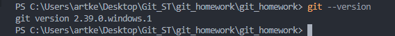

# Инструкция по работе с программой для контроля версий - **Git**.

## Установка. 

* Основой интерфейс для работы с Git-ом является консоль/терминал.

1. ГИТ скачать [тут](https://git-scm.com/book/en/v2/Getting-Started-Installing-Git) и установить его на компьютер.
2. VS Code скачать [тут](https://code.visualstudio.com) и установить.
3. Запустить программу VS Code и в ней открыть терминал.
4. Затем в терминале прописать 

        git --vesion

5. Если Git установлен на компьютер, вы увидите его текущую версию.

 должно быть что-то вроде:

 

6. После этого нужно представиться GITу

     Введя команды:

        git config --global user.email "ВАШ email"

        git config --global user.name "ВАШЕ Имя"

## Создание Git-репозитория:

* Берём локальный каталог, который не находится под версионным контролем, и превращаем его в репозиторий.
* Клонируем существующий репозиторий из любого места.

### Команды для работы с git:

* git init
  
        Инициализация: указываем папку, в которой git начнёт отслеживать изменения.
        В папке создаётся скрытая папка .git

* git status

        Показывает текущее состояние гита, есть ли изменения, которые нужно
        закоммитить (сохранить)

* git add

        Добавляет содержимое рабочего каталога в индекс (staging area) для
        последующего коммита.

        Эта команда дается после добавления файлов. 

        Писать название целиком не обязательно: терминал дозаполнит данные
        автоматически.
* git commit -m "Коментаррий"
        
        Зафиксировать или сохранить

* git commit -a -m "Коментарий"

        Использование ключей "-a" и "-m" объединяет две команды 
        "git add & git commit" в одну.

* git log
  
        Журнал изменений.

        Перед переключением версии файла в Git
        используйте команду git log, чтобы увидеть
        количество сохранений.

* git log --oneline

        Выводит короткий список коммитов

* git checkout

        Переключение между версиями.

        Для работы нужно указать не только интересующий вас коммит, но и вернуться 
        в тот, где работаем, при помощи команды git checkout master.

* git diff

        Показывает разницу между текущим файлом
        и сохранённым.

        Перед переключением версии файла в Git используйте команду git log,
        чтобы увидеть количество сохранений.

* git branch
  
        Если у нас несколько версий черновика, мы можем вывести на экран ветку,
        где находимся.

        Создать ветку можно командой git branch.

        Делать это надо в папке с репозиторием:
        git branch <название новой ветки>
        